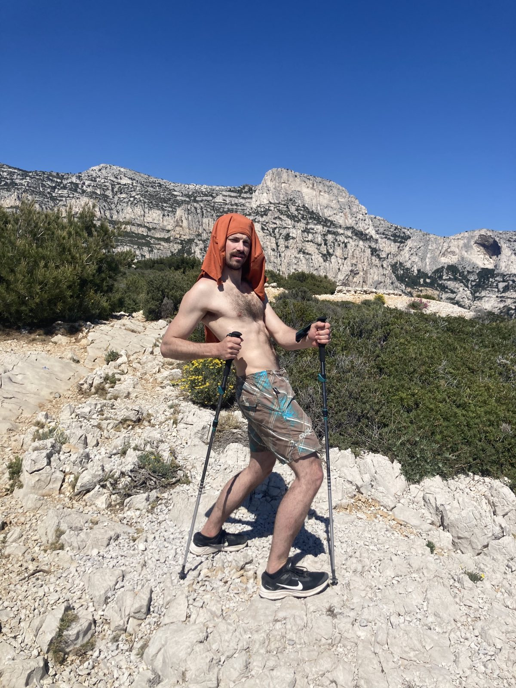

I am the Jakob. Welcome to my personal blog. 

First and foremost, I am still learning how to build this website, so I do not want any comments about its design of this blog. Back off!

Enjoy the content. Thank you and come again! 

# A Picture of The Jakob

(so that you are not confused about some other "Jakob"-s)

# Crossword: The Wisdom of The Jakob 
(100% real Jakob; 100% real quotes)

**1) First step:** _Solve crossword [here](https://crosswordlabs.com/view/jakob-97)_

**2) Second step:** _Come back anytime to see the answers below_

(UNLESS YOU ARE A PARTY (BAT) POOPER, DO NOT UNTOGGLE THE FOLLOWING BEFORE SOLVING THE CROSSWORD!)

   Who is the most famous German climber?

Herman Hesse

What is the main ingredient of Halwa?

 Garlic

What is the vehicle that carries injured people to the hospital?

 Kranken wagon

Who is Edith Piaf?

A techno musician

What is trick to recognize bat poop be recognized by?

  Smell

Why visit Stavanger?

   Marius’s parents

The best investment idea I have? 

Climbing brush made by blind people

